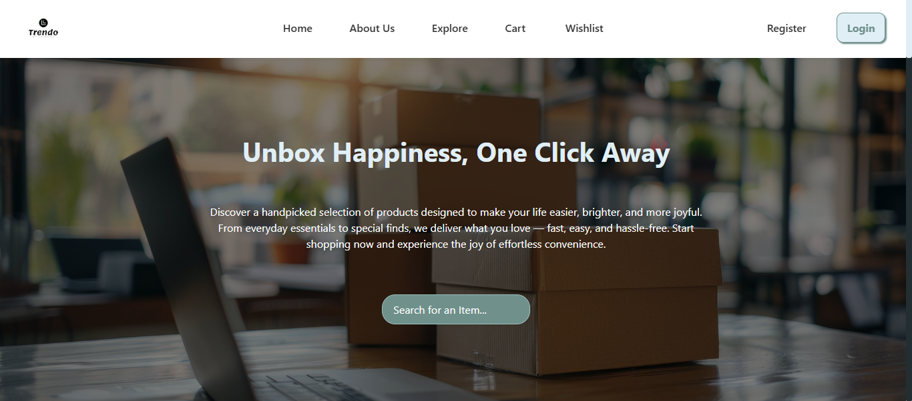

# EcommerceDEPI

**EcommerceDEPI** is a modern, full-stack e-commerce web application developed using **ASP.NET Core MVC**. This project was created as part of the DEPI training program and is aimed at showcasing best practices in scalable web development, clean code architecture, and responsive user interface design.

The platform provides essential e-commerce functionality including secure user registration and login, a dynamic product catalog with filtering, a shopping cart system, order processing, and an administrative backend for managing products and orders.

---


## 🚀 Features

* **User Authentication**

  * Registration and login with password hashing
  * Role-based access (Admin vs Customer)

* **Product Catalog**

  * Dynamic product listing
  * Search and filtering by category and price
  * Product detail pages with images and descriptions

* **Shopping Cart**

  * Add/remove/update products
  * Real-time cart summary

* **Order System**

  * Checkout with order confirmation
  * Order history for users
  * Admin order tracking and management

* **Admin Panel**

  * CRUD operations for products and categories
  * Order overview and status management

---

## 🛠️ Tech Stack

| Layer         | Technology            |
| ------------- | --------------------- |
| Backend       | ASP.NET Core MVC      |
| ORM           | Entity Framework Core |
| Database      | SQL Server            |
| Frontend      | HTML, CSS, JavaScript |
| Auth & Roles  | ASP.NET Identity      |
| Image Uploads | IFormFile via MVC     |

---

## 📁 Project Structure

```bash
EcommerceDEPI/
├── Controllers/
├── Models/
├── Views/
│   ├── Product/
│   ├── Cart/
│   ├── Order/
│   └── Shared/
├── Data/
├── wwwroot/
├── appsettings.json
├── Startup.cs
└── Program.cs
```

---

## 👤 My Contributions

As an active contributor to this project, I focused on:

* Developing and optimizing the **product listing page**, including search and category filtering
* Improving **frontend responsiveness** and JavaScript interactivity
* Debugging and resolving performance issues in view rendering
* Contributing to **admin interface logic** and view organization

---

## 🧪 Getting Started

### Prerequisites

* Visual Studio 2019 or later
* .NET 5.0 SDK or newer
* SQL Server or LocalDB

### Setup Instructions

1. **Clone the repository**

```bash
git clone https://github.com/Ahmvdaziz/EcommerceDEPI.git
cd EcommerceDEPI
```

2. **Configure the database**

Update `appsettings.json` with your SQL Server connection string.

3. **Apply database migrations**

```bash
Update-Database
```

4. **Run the application**

Hit `F5` in Visual Studio or use:

```bash
dotnet run
```

The application will launch at `https://localhost:5001`.

---

## 📸 Screenshots


---

## 📄 License

This project is licensed under the [MIT License](LICENSE).

---

## 🙌 Acknowledgments

* Ahmed Aziz: [Ahmed Aziz](https://github.com/Ahmvdaziz)
* Eman Tamam: [Eman Tamam]()
* Esmail
* Hanna
* A
